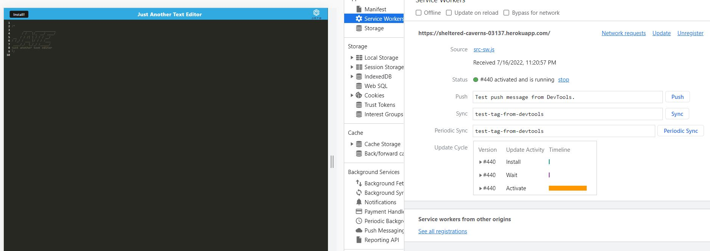

# TextEditor

Hello there! Want to try a text editor other than notepad and that runs in a browser? Welcome to JATE, the text editor that runs in a browser.

># 👉 :point_right:[J.A.T.E Text Editor](https://sheltered-caverns-03137.herokuapp.com/)  <- click
#### How to use?

### :large_blue_circle: JATE Text Editor

*********************************************************************************

### :large_blue_circle: Service worker

*********************************************************************************

### :large_blue_circle: Manifest

*********************************************************************************

### :large_blue_circle: Offline mode

*********************************************************************************

### :large_blue_circle: IndexDB

*********************************************************************************

### :large_blue_circle: App download

:trophy::trophy: yayyy!!! install the app and start working with the editor!:clap::clap::clap:
